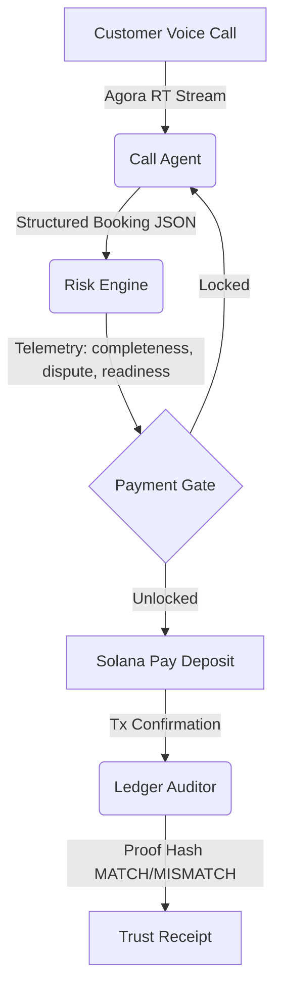

# Call-to-Cash Risk Copilot: Simulated Agent Architecture

The Call-to-Cash Risk Copilot represents an automated transaction decision loop powered by three specialized AI agents collaborating in real-time. This document defines their roles, inputs, decisions, system boundaries, and mandatory implementation workflow.

## 0. Agent Operating Rule

`ECC/` is a local, separately versioned clone of `https://github.com/affaan-m/ECC`. It is an upstream workflow library, not application source and not part of the pnpm workspace.

Before starting any task:

1. Read the project documents relevant to the affected domain using the precedence order below.
2. Inspect only ECC skill metadata first. Search both Codex-ready core skills and the larger catalog:

   ```text
   ECC/.agents/skills/*/SKILL.md
   ECC/skills/*/SKILL.md
   ```

3. Choose the smallest relevant skill set. Read every selected `SKILL.md` completely before acting, then read only the references that skill requires.
4. State in the progress update which ECC skill is being used and why. If no ECC skill fits, continue with project documentation and normal repository workflow.
5. Prefer `skills/` over `commands/`; ECC `commands/` is a legacy compatibility surface. Do not assume ECC hooks, agents, MCP servers, or slash commands are active merely because the repository is cloned.
6. Treat ECC guidance as advisory and lower precedence than this file and the project documentation contracts. If an ECC workflow conflicts with security, API, event, state-machine, data-model, or product docs, the project document wins.
7. Do not edit vendored files under `ECC/` as part of product work. Adapt project-specific behavior in this repository's docs/configuration instead.

Use [docs/operations/ECC-AGENT-WORKFLOW.md](docs/operations/ECC-AGENT-WORKFLOW.md) for task routing, discovery commands, update procedure, and Codex limitations. Avoid loading the full ECC catalog into context.



---

## 1. Call Agent (Agora Voice & UI Interface)

- **Role**: The customer-facing representative. Handles the active speech interaction, turn-taking, interruption, and subtitle rendering.
- **Inputs**: Real-time customer audio stream and text transcriptions.
- **Decisions**:
  - Trích xuất (extract) parameters: route, travel time, number of passengers, contact phone number.
  - Generates responses: acknowledges statements, requests missing values one at a time, and reads out final terms.
- **Off-chain Storage**: Logs user and assistant speech turns under the conversation-turn history database.

---

## 2. Risk Engine (Telemetry Analytics)

- **Role**: The guardian of transaction safety. Monitors conversation semantics to calculate real-time friction scores before booking locking.
- **Inputs**: Live transcription stream and current booking parameters.
- **Decisions**:
  - **Completeness Score (0-100)**: Evaluates if all necessary transaction fields are present.
  - **Dispute Risk (0-100)**: Evaluates customer friction, price hesitation, refund queries, or confusion regarding booking procedures.
  - **Payment Readiness (0-100)**: Measures the customer's intent and compliance to make a deposit.
- **System Gate**: Keeps the payment drawer **LOCKED** until `Completeness >= 85`, `Readiness >= 80`, and `Dispute Risk <= 35`, with all additional confirmation guards defined in the product and state-machine contracts.

---

## 3. Ledger Auditor (Solana Trust Engine)

- **Role**: On-chain security validator. Handles transaction confirmation, reference-to-booking mapping, and agreement payload verification.
- **Inputs**: Solana transaction signature, transfer reference, and the off-chain booking data block.
- **Decisions**:
  - Computes a secure hash of the agreed booking details.
  - Anchors the hash onto the transaction memo/reference block.
  - Verifies ticket matches: compares the local database booking hash against the transaction proof hash to ensure agreement integrity.
  - If a mismatch is discovered (simulated by the **Tamper** action), anchors red warnings and invalidates the boarding pass.

## Documentation-First Implementation Rules

Agents must read the relevant documentation before changing code. Use the documentation-to-code ownership map below to determine what is relevant.

- Product docs define business behavior.
- Architecture docs define system boundaries and technical decisions.
- Contract docs define API payloads, realtime events, errors, and shared schemas.
- Security docs define PII handling and on-chain/off-chain storage restrictions.
- Operations docs define local run, deployment, migration, rollback, and incident-response procedures.
- If code conflicts with documentation, do not silently choose one. Flag the mismatch and update the relevant contract/documentation before or together with the implementation.
- Do not duplicate contracts across frontend and backend. Shared schemas and types are the source of truth.
- Any new endpoint, event, state, table, external provider, or sensitive data field requires a corresponding documentation update.

Use this documentation precedence order:

```text
1. docs/security/DATA-PRIVACY-ONCHAIN-POLICY.md
2. docs/contracts/API-CONTRACT.md
3. docs/contracts/EVENT-CONTRACT.md
4. docs/architecture/STATE-MACHINES.md
5. docs/architecture/DATA-MODEL.md
6. docs/architecture/DECISIONS.md
7. docs/architecture/PIPELINE.md
8. docs/product/BOOKING-CONTRACT.md
9. docs/product/RISK-SCORING.md
10. docs/operations/*.md
```

When documents conflict, the higher document in this precedence order wins until the conflict is explicitly resolved in the affected documents.

## Documentation to Code Ownership Map

| Documentation | Governs | Primary Code Areas |
|---|---|---|
| `docs/architecture/PIPELINE.md` | End-to-end Call → Transcript → Risk → Booking → Payment → Receipt flow | `apps/web`, `apps/api`, `packages/ai`, `packages/solana`, `packages/agora` |
| `docs/architecture/DECISIONS.md` | Technology choices, module boundaries, tradeoffs | Entire repository |
| `docs/architecture/DATA-MODEL.md` | Entities, relationships, retention, indexes, sensitive fields | `packages/db/`, `apps/api/`; planned `prisma/` path documented in `PIPELINE.md` |
| `docs/architecture/STATE-MACHINES.md` | Call, booking, payment, receipt, and payment-gate transitions | `packages/shared/`, `apps/api/` |
| `docs/product/BOOKING-CONTRACT.md` | Booking fields, agreement behavior, confirmation requirements | `packages/shared/`, `packages/ai/`, `apps/web/src/features/`, `apps/api/` |
| `docs/product/RISK-SCORING.md` | Risk scoring rules, thresholds, explanations, payment-gate logic | `packages/ai/`, `apps/api/`, `apps/web/src/features/simulation/` |
| `docs/contracts/API-CONTRACT.md` | HTTP endpoints, DTOs, response shapes, side effects | `apps/api/`, `packages/shared/`, `apps/web/`; dedicated API client paths are planned |
| `docs/contracts/EVENT-CONTRACT.md` | SSE/realtime event names and payloads | `apps/api/`, `packages/shared/`, `apps/web/`; dedicated realtime client paths are planned |
| `docs/contracts/ERROR-CODES.md` | Standard API/domain error codes | `apps/api/`, `packages/shared/` |
| `docs/security/DATA-PRIVACY-ONCHAIN-POLICY.md` | PII handling, audio/transcript retention, Solana on-chain limits | `packages/db/`, `packages/solana/`, `apps/api/`, `apps/web/` |
| `docs/operations/LOCAL-SETUP.md` | Local development workflow | Root tooling, `.env.example`, scripts |
| `docs/operations/DEPLOYMENT.md` | Deployment environment, migration and release process | CI/CD, Docker, deployment config |
| `docs/operations/INCIDENT-RUNBOOK.md` | Operational response and recovery process | Logging, monitoring, rollback procedures |

Paths marked as planned do not currently exist. Verify their status and the relevant architecture decision before relying on or creating them.

### Architecture Boundaries

- Agora is the media plane. Browser/mobile clients connect directly to Agora for realtime voice.
- Do not proxy or relay full voice streams through the Node API.
- Node API is the orchestration layer for call state, transcript persistence, AI analysis, booking state, payment gate, Solana verification, proof records, and trust receipts.
- Frontend must not generate Agora RTC tokens, verify payments authoritatively, access private keys, or access the database directly.
- `packages/ai` owns extraction, scoring, payment-gate policy, and recommendation logic.
- `packages/solana` owns Solana Pay generation, transaction parsing, verification, payment reference generation, and proof hash utilities.
- `packages/agora` owns server-side Agora token generation, webhook parsing, recording helpers, and event normalization.
- `packages/db` owns Prisma client setup and repositories. Business logic must not be scattered into raw database calls.
- `packages/shared` owns Zod schemas, API DTOs, enums, domain types, constants, and event contracts.
- `packages/domain` owns pure state transitions, risk/payment-gate policy, agreement rules, and inventory guards without framework, database, provider, or network dependencies.

### Privacy and Blockchain Rules

- Never store full audio, full transcript, raw phone number, raw customer PII, or the full agreement payload on Solana.
- Keep full transcript, booking details, AI score reasoning, optional recording references, and PII off-chain in PostgreSQL.
- Solana/on-chain records may contain only the payment transaction information, tx signature, reference, memo, proof hash, receipt verification metadata, and other approved non-PII values.
- Never expose Agora App Certificate, Solana private keys, database URLs, webhook secrets, or LLM API keys to the frontend.
- Mask phone numbers and PII in non-authorized views, logs, analytics, and realtime events.

### State-Machine Rules

- Never introduce a new call, booking, payment, receipt, or payment-gate state without updating `docs/architecture/STATE-MACHINES.md`.
- Never transition state by directly assigning arbitrary status strings.
- State transitions must be validated by a centralized domain/service layer.
- Payment intent creation is prohibited unless the payment gate is open and booking confirmation requirements are satisfied.
- Payment confirmation must be verified server-side and must be idempotent.
- Trust receipt creation must be idempotent and linked to a canonical agreement payload hash.

### API and Event Contract Rules

- Any API endpoint addition or modification requires updating `docs/contracts/API-CONTRACT.md`.
- Any websocket/realtime event addition or modification requires updating `docs/contracts/EVENT-CONTRACT.md`.
- Any new error condition or changed error response requires updating `docs/contracts/ERROR-CODES.md`.
- Validate external input using shared Zod schemas.
- Use shared DTOs/types from `packages/shared`; do not duplicate request/response types in frontend and backend.
- Keep API responses consistent with the documented success/error envelope.
- Never use undocumented realtime event names.

## Required Workflow for Any Feature Change

1. Identify affected domain: call, transcript, risk, booking, payment, proof, receipt, dashboard, deployment, or security.
2. Read every relevant document from the documentation-to-code ownership map.
3. Check API, event, state-machine, data-model, and privacy impact before writing code.
4. Update documentation first or in the same change set if the behavior/contract changes.
5. Update `packages/shared` schemas/enums/types before implementing frontend/backend changes.
6. Implement backend domain logic and persistence.
7. Implement API routes and realtime events.
8. Implement frontend integration.
9. Add/update tests for business rules, invalid transitions, and contract validation.
10. Run lint, typecheck, test, and build.
11. Summarize documentation changes, code changes, migration requirements, and unimplemented integration dependencies.

Every agent response after a code change must include:

```text
- Documentation consulted
- Documentation updated
- Files changed
- Contracts changed
- Database migration required: yes/no
- Environment variables added/changed
- Tests run
- Remaining TODOs or mocked integrations
```

## New Feature Change Checklist

Before implementation, check:

- [ ] Is the product behavior covered by `BOOKING-CONTRACT.md` or `RISK-SCORING.md`?
- [ ] Does it add/change an API endpoint?
- [ ] Does it add/change a realtime event?
- [ ] Does it add/change a domain state or transition?
- [ ] Does it add/change a database entity, field, index, or retention policy?
- [ ] Does it handle PII, audio, transcript, payment, wallet, or blockchain data?
- [ ] Does it require a new environment variable or third-party credential?
- [ ] Does it need demo-mode behavior?
- [ ] Does it need unit, integration, or end-to-end tests?
- [ ] Does it require deployment, migration, rollback, or incident-runbook changes?

## Demo Mode Policy

- The project must support an explicit `DEMO_MODE=true` configuration.
- Demo mode may use deterministic mock transcript events, mock AI provider responses, mock payment confirmation, and simulated Agora metadata.
- Demo mode must preserve real domain state transitions and real rule-based risk logic.
- Demo mode must never silently pretend a production blockchain transaction or Agora connection occurred.
- Any mocked provider or simulation must be clearly documented in the final implementation summary.
