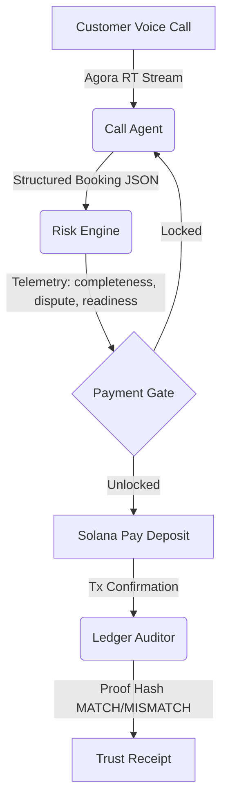

# Call-to-Cash Risk Copilot: Simulated Agent Architecture

The Call-to-Cash Risk Copilot represents an automated transaction decision loop powered by three specialized AI agents collaborating in real-time. This document defines their roles, inputs, decisions, and system boundaries.

## 0. Agent Operating Rule
- Before starting any task, do a lightweight scan of the local `ECC/` repository, especially its skills, commands, rules, and context docs, to choose the most relevant skill/workflow and understand the user's requirement more accurately before editing or answering.

---

## 1. Call Agent (Agora Voice & UI Interface)
- **Role**: The customer-facing representative. Handles the active speech interaction, turn-taking, interruption, and subtitle rendering.
- **Inputs**: Real-time customer audio stream and text transcriptions.
- **Decisions**: 
  - Trích xuất (extract) parameters: route, travel time, number of passengers, contact phone number.
  - Generates responses: acknowledges statements, requests missing values (one at a time), reads out final terms.
- **Off-chain Storage**: Logs user and assistant speech turns under the conversation turns history database.

---

## 2. Risk Engine (Telemetry Analytics)
- **Role**: The guardian of transaction safety. Monitors conversation semantics to calculate real-time friction scores before booking locking.
- **Inputs**: Live transcription stream and current booking parameters.
- **Decisions**:
  - **Completeness Score (0-100)**: Evaluates if all necessary transaction fields are present.
  - **Dispute Risk (0-100)**: Evaluates customer friction, price hesitation, refund queries, or confusion regarding booking procedures.
  - **Payment Readiness (0-100)**: Measures the customer's intent and compliance to make a deposit.
- **System Gate**: Keeps the payment drawer **LOCKED** until `Completeness >= 85`, `Readiness >= 80`, and `Dispute Risk <= 35`.

---

## 3. Ledger Auditor (Solana Trust Engine)
- **Role**: On-chain security validator. Handles transaction confirmation, reference-to-booking mapping, and agreement payload verification.
- **Inputs**: Solana transaction signature, transfer reference, and the off-chain booking data block.
- **Decisions**:
  - Computes a secure hash of the agreed booking details.
  - Anchors the hash onto the transaction memo/reference block.
  - Verifies ticket matches: compares the local database booking hash against the transaction proof hash to ensure agreement integrity.
  - If a mismatch is discovered (simulated by the **Tamper** action), anchors red warnings and invalidates the boarding pass.
