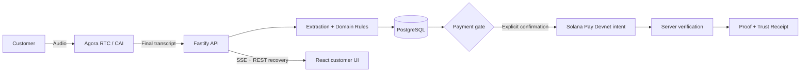

# Call-to-Cash Risk Copilot

Call-to-Cash Risk Copilot turns a bus-booking conversation into a server-authoritative booking, confirmation, deposit, and proof flow. It supports a deterministic replay demo and an optional Agora live-voice path; both use the same booking, risk, agreement, payment-gate, and receipt authority.

```text
Customer voice or replay
  → final transcript admission
  → booking extraction and risk scoring
  → booking summary and agreement confirmation
  → Solana Pay Devnet deposit request
  → server-side verification, proof, and Trust Receipt
```

## What is implemented

| Capability | Current behavior |
| --- | --- |
| Voice | Browser connects directly to Agora RTC for live mode; replay stays explicitly labelled as replay. |
| Vietnamese transcription | Agora join properties default ASR to `vi-VN`; only final provider turns may become durable business input. |
| Booking extraction | Deterministic Vietnamese parsing is the safe baseline. Optional OpenAI structured extraction may fill only high-confidence, same-turn, catalogue-validated draft fields. |
| Booking summary | REST/SSE recovery reloads the authoritative booking read model. The customer view shows route, departure date/time, passengers, masked phone, fare, and deposit. |
| Confirmation | `READY_FOR_CONFIRMATION` renders a web confirmation card. The customer may tap **Xác nhận điều khoản & mở thanh toán** or make an explicit voice confirmation. |
| Payment | Server-created mock or Solana Pay Devnet payment intent; the browser never decides payment success. |
| Proof and receipt | Server verifies payment evidence, writes a canonical agreement proof, and issues a privacy-safe Trust Receipt. Tamper simulation produces a mismatch/manual-review state. |
| Recovery | SSE reconnect plus REST recovery restores booking, transcript, payment, and receipt state using privacy-safe projections. |
| Revenue Twin | Fleet Revenue Twin evaluates constrained alternatives, bounded incentives, consented acceptance, and waitlist fallback without browser authority over inventory or price. |

## Architecture and authority



- The browser owns microphone permission, direct RTC connectivity, and rendering.
- The API owns transcript admission, booking state, risk, agreement locking, payment intent creation, payment verification, proof, and receipt issuance.
- PostgreSQL is durable truth for bookings, events, idempotency, and recovery.
- Solana Devnet stores payment evidence only. It never receives raw PII, full transcript, or the full agreement payload.

## Modes

| Mode | Use case | Truth boundary |
| --- | --- | --- |
| Replay | Deterministic demo and regression testing | Replay turns follow the same API/domain path; it is never labelled as live Agora. |
| Agora live | Customer microphone and agent conversation | Final trusted provider turns enter the same canonical transcript command. |
| Mock payment | Fast deterministic payment/proof demo | The server validates server-owned mock evidence. |
| Solana Devnet | Wallet/QR demonstration | The server creates and verifies a Devnet request; it is not commercial settlement. |

## Repository layout

```text
apps/
  api/          Fastify orchestration, API, SSE, persistence commands
  rtm-relay/    Isolated Agora RTM relay for live transcript events
  web/          React/Vite customer, operator, payment, and receipt UI
packages/
  ai/           Extraction, scoring, payment-gate recommendations
  agora/        Agora tokens, CAI join properties, webhook parsing
  config/       Server and browser-safe runtime configuration
  db/           Prisma client, repositories, migration tooling
  domain/       Pure booking, agreement, inventory, and gate transitions
  shared/       Zod schemas, DTOs, events, enums, error vocabulary
  solana/       Solana Pay request, transaction parsing, verification, proof helpers
docs/           Product, architecture, contracts, security, operations, reports
```

## Quick start

Requirements: Node.js 20.19+ (the workspace is validated on Node 20.20.2), Corepack, Docker Desktop for PostgreSQL, and a copied root `.env`.

```powershell
Copy-Item .env.example .env
corepack pnpm install
docker compose up -d postgres
corepack pnpm db:migrate:deploy
corepack pnpm db:seed
```

Start the API and web app in separate terminals:

```powershell
corepack pnpm dev:api
corepack pnpm dev:web
```

For Agora live mode, configure the server-only Agora values in root `.env`, set `VOICE_PROVIDER=agora`, then run the isolated relay as well:

```powershell
corepack pnpm dev:rtm-relay
```

The web app is normally available at `http://127.0.0.1:5173`; the API readiness endpoint is `http://127.0.0.1:3001/ready`.

## Configuration

The root `.env` is the canonical local server configuration. Browser-safe values belong in `apps/web/.env.local` or `apps/web/.env` and must use the `VITE_` prefix.

Key switches:

```dotenv
DEMO_MODE=true
VOICE_PROVIDER=replay              # or agora
VITE_VOICE_PROVIDER=replay         # keep browser label aligned with server
PAYMENT_PROVIDER=mock              # or solana_devnet
AI_PROVIDER=deterministic          # or openai
AI_EXTRACTION_MODE=hybrid
```

When using Agora, keep certificates, customer secrets, relay control secrets, notification webhook secrets, and API keys server-only. Do not place them in a `VITE_` variable.

For a Devnet wallet flow, set `PAYMENT_PROVIDER=solana_devnet` and configure `SOLANA_RPC_URL`, `SOLANA_RECIPIENT_PUBLIC_KEY`, and `SOLANA_DEMO_AMOUNT_LAMPORTS`. The Devnet amount is demonstration evidence, not VND settlement.

## Verification commands

```powershell
corepack pnpm test
corepack pnpm lint
$env:CI='true'; corepack pnpm build

# Secret-safe readiness check for env, database, API, web, relay, and Devnet configuration
corepack pnpm demo:preflight

# Runs Scenario 4 against an already-running stack
corepack pnpm demo:smoke

# Starts PostgreSQL/API/web/relay temporarily, verifies the full Scenario 4 path, then cleans up children
corepack pnpm demo:smoke:cold
```

The cold smoke test fails closed unless the authoritative booking summary contains the expected route, Vietnamese-local departure date/time, passenger count, supported pickup point, masked phone, fare, and deposit before it can create the Devnet payment intent.

## Safety rules

- Interim transcripts are UX-only and never mutate booking/payment state.
- Final customer turns are the only transcript source that can propose booking facts.
- Payment requires complete terms, active inventory hold, explicit confirmation of the current agreement version, and an unlocked gate.
- A material booking change invalidates confirmation and requires a new agreement version.
- The server verifies recipient, amount, reference, signature/finality, expiry, and one-time consumption before issuing a receipt.
- Logs, events, analytics, browser persistence, and on-chain data use masked/minimal data only.

## Documentation

- Current state
- Pipeline
- State machines
- Booking contract
- Risk scoring
- API contract
- Event contract
- Data privacy and on-chain policy
- Local setup
- Deployment

## License and demo boundary

This repository is a demonstration and engineering prototype. It does not represent a production transport operator, custodial wallet service, or commercial payment processor. Review the security, privacy, provider, and operational contracts before any production deployment.